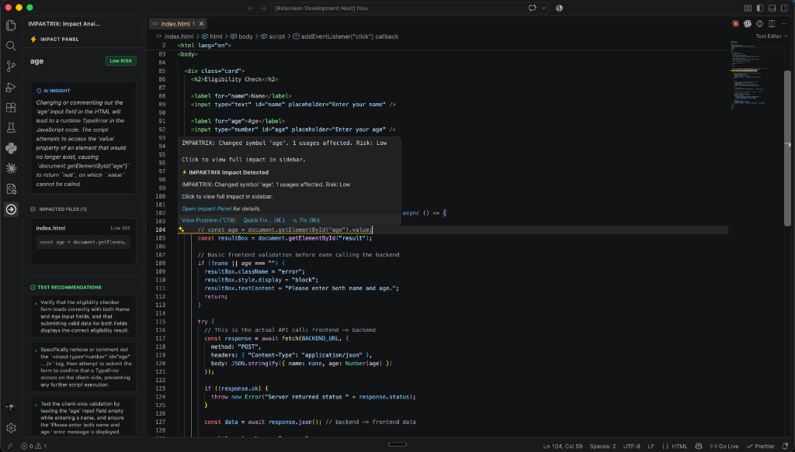

# IMPAKTRIX: Code Impact Intelligence Platform

See the impact before the change. IMPAKTRIX is a universal code impact analysis tool built as both a **VS Code Extension** and a **Model Context Protocol (MCP) Server**. It uses local dependency graph analysis combined with AI-powered reasoning to show you the "blast radius" of any code change.



## Features

- **VS Code Extension**: Real-time detection of code changes in VS Code, with visual gutter icons and an interactive Impact Panel.
- **MCP Server Integration**: Exposes the `analyze_impact` tool for AI agents (like Antigravity or Claude Desktop) to proactively assess the impact of their code changes.
- **AI-Powered Insights**: Uses Google's Gemini to explain the severity and implications of code changes and suggest test cases.
- **Universal Adapters**: Designed to support multiple languages (TypeScript, Python, etc.) via a pluggable adapter system.

## Getting Started

### Prerequisites
- Node.js (v18+)
- A Google GenAI API Key

### Setup
1. Clone the repository and install dependencies:
   ```bash
   npm install
   ```
2. Set up your environment variables:
   ```bash
   cp .env.example .env
   ```
   Add your `API_KEY` to the `.env` file.

3. Compile the project:
   ```bash
   npm run compile
   ```
   This will build the VS Code extension (`out/extension.js`), the React Webview (`out/webview/bundle.js`), and the MCP Server (`out/mcp.js`).

## Installation & Usage

### 1. VS Code Extension (Local Install)
You can permanently install IMPAKTRIX into your own VS Code without publishing it to the public marketplace:
1. Package the extension into a `.vsix` file:
   ```bash
   npx @vscode/vsce package
   ```
2. Open VS Code, go to the **Extensions** sidebar.
3. Click the `...` menu at the top right of the extensions pane and select **"Install from VSIX..."**.
4. Select the generated `.vsix` file. IMPAKTRIX will now automatically analyze code in any project you open!

### 2. MCP Server (Global AI Agent Integration)
To give AI agents (like Antigravity or Claude Desktop) access to IMPAKTRIX across *all* your projects:
1. Copy the `mcp_config.json` file into your global agent configuration directory (e.g., `~/.gemini/config/` for Antigravity).
2. Edit the copied `mcp_config.json` and replace `${workspaceFolder}/out/mcp.js` with the **absolute path** to the `out/mcp.js` file on your computer.
3. Restart your AI editor. Your agent now has a permanent `analyze_impact` tool for every project!
